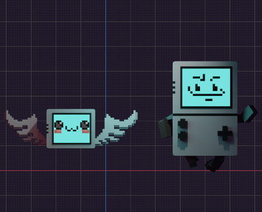

# MetaBound_

<table style="padding:10px">
  <tr>
    <td> 
    </td>
    <td> 
    </td>
  </tr>
</table>

Entry for the MetaBoy Gamejam, November 2022.
Using three.js (3D graphics) + cannon-es.js (Physics) and a few other libraries - to create some 3D javascript for the first time.

Mostly unfinished, more of a 3D demo than anything else. Some of the roughest code I've ever drop-kicked together. But learnt a stack!

Submission/playable: https://itch.io/jam/metaboy-game-jam/rate/1791623

[Minted on the blockchain (v0.0.2)](https://explorer.loopring.io/nft/0x22b60c6ff19b6590216d5a45a96de404cd1897d3-0-0xfe23138c751c8146f2787738ba63333240508901-0xba2cd74f83711316bede9b16070a33d4d0bd23999911bb249ee3dde18b034bea-4)

#MakeYourMeta, 2022
